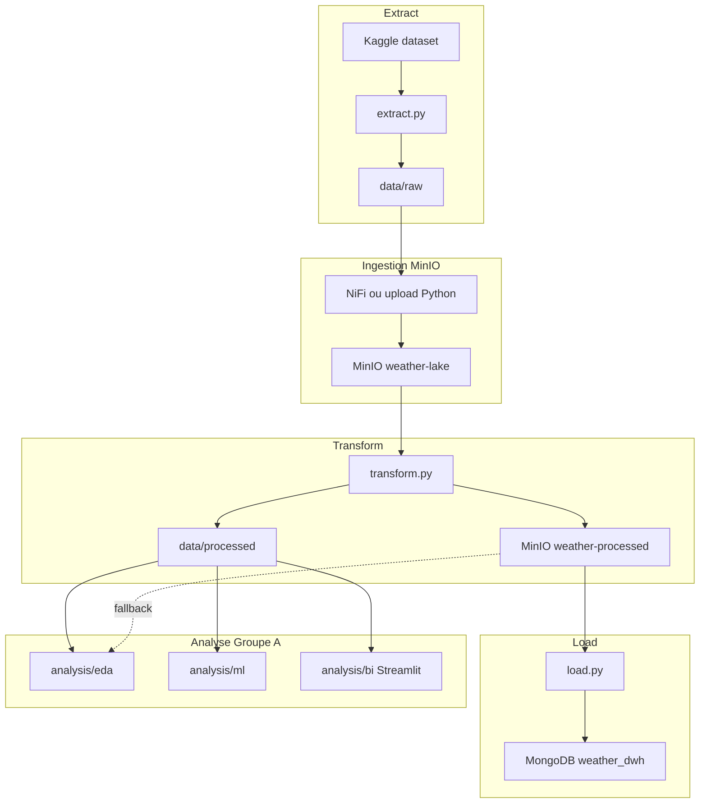

# Weather Data Platform

Projet **ForceN — Groupe A** : chaîne complète de la donnée météo, de l’ingestion à l’analyse et à la prédiction.

## Contexte

| | |
|---|---|
| **Formation** | Data Engineering — ForceN |
| **Équipe** | Groupe A |
| **Dataset** | [Weather Dataset (Kaggle)](https://www.kaggle.com/datasets/muthuj7/weather-dataset) — observations météorologiques horaires à Szeged (Hongrie), 2005–2016 |
| **Objectif** | Construire un pipeline ETL reproductible (MinIO + MongoDB), puis exploiter les données via EDA, ML et BI |
| **Dépôt** | [weather-data-platform](https://github.com/Mourtalla-8/weather-data-platform) |

Le projet couvre **deux volets intégrés** :

1. **ETL** — extraction Kaggle, data lake MinIO, transformation Python, chargement MongoDB (`weather_dwh`)
2. **Analyse** — EDA statistique, Random Forest (température), dashboard Streamlit

Les jeux de données utilisés par l’analyse proviennent **uniquement** des sorties ETL : fichier enrichi local (`data/processed/`) ou objet MinIO `weather-processed/weather_processed_enriched.csv` (même contenu). MongoDB reçoit le CSV **clean** pour le DWH ; le BI/ML s’appuie sur la version **enrichie**.

## Architecture



## Documentation

| Document | Description |
|---|---|
| [**rapport/groupe_a_projet_final.pdf**](rapport/groupe_a_projet_final.pdf) | **Rapport final** du projet |
| [**rapport/presentation_groupe_a_final.pptx**](rapport/presentation_groupe_a_final.pptx) | **Présentation finale** |
| [rapport/README.md](rapport/README.md) | Index livrables, exports, assets |
| [analysis/README.md](analysis/README.md) | Guide analyse (sources ETL, EDA, ML, Streamlit) |
| [rapport/docs/nifi-ingestion.md](rapport/docs/nifi-ingestion.md) | Guide NiFi |

Source Marp (régénération) : [rapport/marp/](rapport/marp/README.md)

---

## Structure du projet

```
weather-data-platform/
├── docker-compose.yml
├── requirements.txt
├── requirements-analysis.txt
├── etl/                         # Pipeline ETL
├── analysis/                    # EDA, ML, BI (données = sortie ETL)
├── scripts/
│   ├── lib/common.py            # Utilitaires partagés
│   ├── setup.py
│   ├── run_pipeline.py
│   ├── run_analysis.py
│   └── reset.py
├── rapport/
│   ├── groupe_a_projet_final.pdf
│   ├── presentation_groupe_a_final.pptx
│   ├── docs/                    # Guides techniques
│   ├── assets/                  # Captures, diagrammes, figures
│   ├── exports/                 # CSV + dump MongoDB exportés
│   └── marp/                    # Source présentation
├── outputs/                     # Figures analyse (gitignored)
└── data/                        # Runtime ETL (gitignored)
```

### Stockage MinIO - deux buckets séparés

| Bucket | Rôle | Objets |
|---|---|---|
| `weather-lake` | Données brutes (raw) | `raw/weatherHistory.csv` |
| `weather-processed` | Données nettoyées (processed) | `weather_processed.csv`, `weather_processed.parquet`, `weather_processed_enriched.csv`, `weather_processed_enriched.parquet`, `weatherHistory_clean_metadata.json` |

Les scripts ETL créent automatiquement les buckets s'ils n'existent pas.

---

## Prérequis

- **Docker** et **Docker Compose** (v2+)
- **Python 3.11+**
- Ports locaux disponibles : `27017`, `9000`, `9001`, `8443`

---

## Installation (clone GitHub)

```bash
git clone https://github.com/Mourtalla-8/weather-data-platform
cd weather-data-platform

python scripts/setup.py --with-analysis
```

Le script `setup.py` vérifie les prérequis (Python, Docker), crée `.env` et `.venv`, installe les dépendances et démarre Docker.

Ensuite, lancez le pipeline complet puis l'analyse :

```bash
python scripts/run_pipeline.py
python scripts/run_analysis.py
```

Pour remettre le projet à zéro (comme le dépôt GitHub) :

```bash
python scripts/reset.py        # supprime data/ et arrête Docker
python scripts/reset.py --full # supprime aussi .venv
python scripts/setup.py        # reconfiguration
```

### Scripts disponibles

| Script | Rôle |
|---|---|
| `scripts/setup.py` | Configuration initiale après clone (`--with-analysis` pour EDA/ML/BI) |
| `scripts/run_pipeline.py` | Pipeline ETL complet (extract -> MinIO -> transform -> load) |
| `scripts/run_analysis.py` | Vérification dataset enrichi + entraînement ML |
| `scripts/reset.py` | Reset du projet (état propre) |

---

## Variables d'environnement

Copiez `.env.example` vers `.env`. Variables principales :

| Variable | Description | Valeur par défaut |
|---|---|---|
| `MONGO_USER` / `MONGO_PASSWORD` | Auth MongoDB (Docker) | `groupea_de` / `ForceN-GroupeA-Mongo` |
| `MINIO_USER` / `MINIO_PASSWORD` | Auth MinIO (Docker) | `groupea_de` / `ForceN-GroupeA-MinIO` |
| `MINIO_ACCESS_KEY` / `MINIO_SECRET_KEY` | Auth MinIO (scripts Python) | Doit correspondre à `MINIO_USER` / `MINIO_PASSWORD` |
| `NIFI_USER` / `NIFI_PASSWORD` | Auth NiFi UI | `groupea_de` / `ForceN-GroupeA-NiFi` |
| `MINIO_RAW_BUCKET` | Bucket données brutes | `weather-lake` |
| `MINIO_PROCESSED_BUCKET` | Bucket données nettoyées | `weather-processed` |
| `MONGO_DB` | Base MongoDB du DWH | `weather_dwh` |
| `MONGO_COLLECTION` | Collection des observations | `weather_observations` |

> **Note** : si le mot de passe MongoDB contient des caractères spéciaux (`@`, `/`, etc.), le script `load.py` encode automatiquement l'URI à partir de `MONGO_USER` et `MONGO_PASSWORD`.

---

## Pipeline ETL - étape par étape

### 1. Démarrer l'infrastructure

```bash
docker compose up -d
docker compose ps
```

Attendez que MongoDB et MinIO soient `healthy` avant de lancer les scripts.

### 2. Extract - télécharger le dataset

```bash
python etl/extract.py
```

Le script utilise `kagglehub` pour télécharger automatiquement le dataset public. Aucune variable `.env` ni configuration manuelle n'est requise.

**Résultat** : fichiers copiés dans `./data/raw/` (dont `weatherHistory.csv`).

### 3. NiFi - upload raw vers MinIO

#### a) Importer le Process Group

1. Ouvrir NiFi : [https://localhost:8443](https://localhost:8443) (identifiants `NIFI_USER` / `NIFI_PASSWORD`)
2. Copier le JSON du Process wwwwGroup `Ingestion` depuis [rapport/docs/nifi-ingestion.md — section 7](rapport/docs/nifi-ingestion.md#7-import-rapide-du-process-group-json)
3. Sur le canvas NiFi : clic droit → **Paste** (ou `Ctrl+V`) pour importer le Process Group
4. Le Process Group contient les processeurs nécessaires (`GetFile` et `PutS3Object`)

> Guide complet : [rapport/docs/nifi-ingestion.md](rapport/docs/nifi-ingestion.md)

#### b) Configurer les credentials MinIO (Controller Service)

1. **Double-cliquer** sur le Process Group pour entrer à l'intérieur
2. Ouvrir l'onglet **Controller Services** (icône engrenage dans la barre latérale)
3. Configurer `AWSCredentialsProviderControllerService` :
   - **Access Key ID** : valeur de `MINIO_ACCESS_KEY` (identique à `MINIO_USER`)
   - **Secret Access Key** : valeur de `MINIO_SECRET_KEY` (identique à `MINIO_PASSWORD`)
4. **Activer** le Controller Service (clic droit -> Enable)

#### c) Vérifier les processeurs

Dans le Process Group, vérifier la configuration du processeur `PutS3Object` :

| Paramètre | Valeur |
|---|---|
| **Endpoint Override URL** | `http://minio:9000` |
| **Bucket** | `weather-lake` |
| **Object Key** | `raw/weatherHistory.csv` |
| **AWS Credentials Provider** | `AWSCredentialsProviderControllerService` |

Le processeur `GetFile` lit depuis `/opt/nifi/input/` (monté depuis `./data/raw/`).

#### d) Lancer le flow

1. Sélectionner le Process Group
2. Clic droit -> **Start**
3. Vérifier dans la MinIO Console que `weather-lake/raw/weatherHistory.csv` est présent

### 4. Transform - nettoyage et normalisation

```bash
python etl/transform.py
```

**Ce script** :
- lit `weather-lake/raw/weatherHistory.csv` depuis MinIO (fallback local si MinIO indisponible),
- nettoie et normalise les données,
- produit une version **CLEAN** et une version **ENRICHED**,
- sauvegarde localement dans `./data/processed/`,
- upload vers le bucket `weather-processed` (CSV, Parquet et métadonnées).

Fichiers produits localement (`./data/processed/`) :

| Fichier | Description |
|---|---|
| `weather_processed.csv` | Dataset nettoyé (11 colonnes) |
| `weather_processed.parquet` | Version Parquet du dataset nettoyé |
| `weather_processed_enriched.csv` | Version enrichie (colonnes temporelles) |
| `weather_processed_enriched.parquet` | Version Parquet enrichie |
| `weatherHistory_clean_metadata.json` | Métadonnées du run |

Fichiers uploadés dans MinIO (`weather-processed`) :

| Fichier | Description |
|---|---|
| `weather_processed.csv` | Dataset nettoyé - **utilisé pour MongoDB** |
| `weather_processed.parquet` | Version Parquet du dataset nettoyé |
| `weather_processed_enriched.csv` | Version enrichie |
| `weather_processed_enriched.parquet` | Version Parquet enrichie |
| `weatherHistory_clean_metadata.json` | Métadonnées du run |

### 5. Load - chargement MongoDB

```bash
python etl/load.py
```

**Ce script** :
- lit `weather_processed.csv` depuis le bucket `weather-processed` (fallback : `./data/processed/weather_processed.csv`),
- **remplace** entièrement la collection (aucun doublon),
- insère les documents dans `weather_dwh.weather_observations`,
- crée les index (`date_time` unique, `precip_type`).

---

## Accès aux services

| Service | URL | Identifiants |
|---|---|---|
| **MinIO Console** | [http://localhost:9001](http://localhost:9001) | `MINIO_USER` / `MINIO_PASSWORD` |
| **MinIO API (S3)** | [http://localhost:9000](http://localhost:9000) | idem |
| **NiFi** | [https://localhost:8443](https://localhost:8443) | `NIFI_USER` / `NIFI_PASSWORD` |
| **MongoDB** | `mongodb://localhost:27017` | `MONGO_USER` / `MONGO_PASSWORD` (authSource: `admin`) |

### Volumes NiFi montés

| Chemin conteneur | Chemin hôte | Usage |
|---|---|---|
| `/opt/nifi/input` | `./data/raw` | Fichiers bruts (extract) |
| `/opt/nifi/custom-scripts` | `./scripts` | Scripts personnalisés |

---

## Data Warehouse MongoDB

| Élément | Valeur |
|---|---|
| Base de données | `weather_dwh` |
| Collection | `weather_observations` |
| Documents attendus | ~96 429 |

### Schéma d'un document

```json
{
  "date_time": "2006-01-01T00:00:00Z",
  "summary": "Mostly Cloudy",
  "precip_type": "rain",
  "temperature_c": 1.16,
  "apparent_temperature_c": -3.24,
  "humidity": 0.85,
  "wind_speed_km_per_h": 16.62,
  "wind_bearing_degrees": 139.0,
  "visibility_km": 9.90,
  "pressure_millibars": 1016.15,
  "daily_summary": "Mostly cloudy throughout the day."
}
```

### Index

| Index | Champ | Type |
|---|---|---|
| `idx_date_time_unique` | `date_time` | unique |
| `idx_precip_type` | `precip_type` | standard |

### Vérification

Remplacez `<user>` et `<password>` par vos valeurs `.env` :

```bash
mongosh "mongodb://<user>:<password>@localhost:27017/?authSource=admin" \
  --eval 'db.getSiblingDB("weather_dwh").weather_observations.countDocuments()'

mongosh "mongodb://<user>:<password>@localhost:27017/?authSource=admin" \
  --eval 'db.getSiblingDB("weather_dwh").weather_observations.findOne()'
```

Résultat attendu : `96429` documents.

---

## Analyse (EDA / ML / BI)

Après le pipeline ETL, l’analyse consomme le dataset enrichi via `analysis/paths.py` :

1. `data/processed/weather_processed_enriched.csv` (sortie locale de `transform.py`)
2. Sinon téléchargement depuis MinIO `weather-processed/weather_processed_enriched.csv`

```bash
python scripts/run_analysis.py
jupyter notebook analysis/eda/EDA_Analyse_Statistique.ipynb
streamlit run analysis/bi/app.py
```

Voir [analysis/README.md](analysis/README.md).

---

## Livrables

Notre projet livre :

### 1. MinIO - bucket `weather-processed`

| Objet | Description |
|---|---|
| `weather_processed.csv` | Dataset nettoyé principal |
| `weather_processed.parquet` | Version Parquet du dataset nettoyé |
| `weather_processed_enriched.csv` | Version avec colonnes temporelles |
| `weather_processed_enriched.parquet` | Version Parquet enrichie |
| `weatherHistory_clean_metadata.json` | Métadonnées du pipeline |

- **Accès** : MinIO Console ([http://localhost:9001](http://localhost:9001)) ou SDK S3 (endpoint `http://localhost:9000`)

### 2. MongoDB - Data Warehouse

- **URI** : `mongodb://<user>:<password>@localhost:27017/?authSource=admin`
- **Base** : `weather_dwh`
- **Collection** : `weather_observations`
- **Connexion** : `mongosh`, Compass, ou driver Python/BI (`pymongo`, etc.)

### 3. Analyse intégrée

| Composant | Emplacement |
|---|---|
| EDA statistique | `analysis/eda/EDA_Analyse_Statistique.ipynb` |
| Dashboard Streamlit | `analysis/bi/app.py` |
| Prédiction ML (Random Forest) | `analysis/ml/train_predict.py` |
| Figures générées | `outputs/eda/`, `outputs/ml/` |

---

## Dépannage

### MinIO : bucket introuvable (`NoSuchBucket`)

Les buckets sont créés automatiquement par `etl/transform.py`. Si vous chargez directement via `load.py`, lancez d'abord `transform.py` ou créez le bucket `weather-processed` manuellement dans la console MinIO.

### MinIO : connexion refusée

```bash
docker compose ps          # vérifier que minio est "healthy"
docker compose logs minio
```

Vérifiez que `MINIO_ACCESS_KEY` / `MINIO_SECRET_KEY` dans `.env` correspondent à `MINIO_USER` / `MINIO_PASSWORD`.

### MongoDB : authentification échouée

Vérifiez que `MONGO_USER` / `MONGO_PASSWORD` dans `.env` correspondent aux credentials du docker-compose.

```bash
docker compose logs mongodb
```

### Transform : fichier raw introuvable

1. Lancez `python etl/extract.py`
2. Uploadez vers MinIO via NiFi (`weather-lake/raw/weatherHistory.csv`)
3. Ou placez le fichier dans `./data/minio/weather-lake/raw/weatherHistory.csv` (fallback local)

### Load : colonnes manquantes

Le script attend le CSV **CLEAN** produit par `etl/transform.py` (11 colonnes). Relancez la transformation si le format ne correspond pas.

### NiFi : certificat auto-signé

Le navigateur affichera un avertissement SSL sur `https://localhost:8443`. Acceptez l'exception pour accéder à l'interface.

### NiFi : échec upload vers MinIO

Vérifiez que le Controller Service `AWSCredentialsProviderControllerService` est **activé** (Enable) et que les credentials MinIO sont corrects.

### Docker : healthcheck MongoDB en échec

Après modification du `docker-compose.yml`, recréez les conteneurs :

```bash
docker compose up -d --force-recreate mongodb minio
```

---

## Commandes utiles

```bash
# Arrêter l'infrastructure
docker compose down

# Arrêter et supprimer les volumes (reset complet des données)
docker compose down -v

# Relancer tout le pipeline
python scripts/run_pipeline.py

# Voir les logs d'un service
docker compose logs -f minio
docker compose logs -f mongodb
```

---

## Équipe

**ForceN — Groupe A**

Pipeline complet : Extract → Data Lake (MinIO) → Transform → Data Warehouse (MongoDB) → Analyse (EDA / ML / BI).
