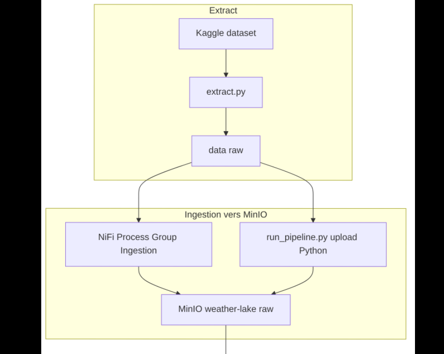
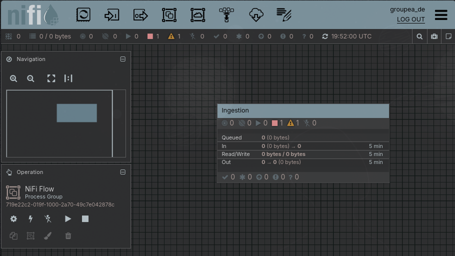
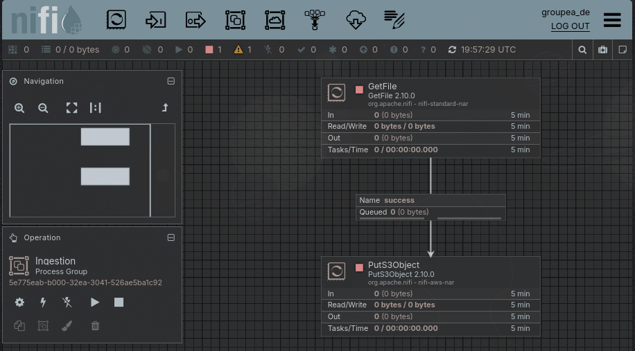
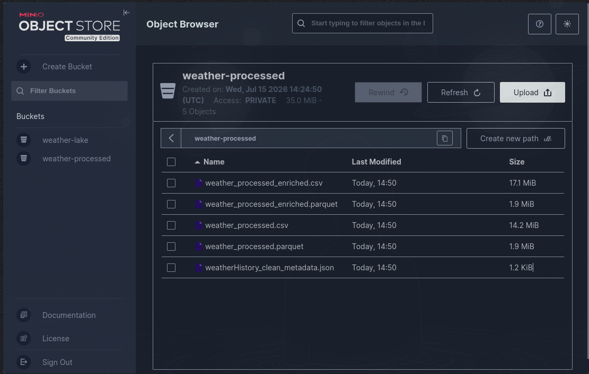
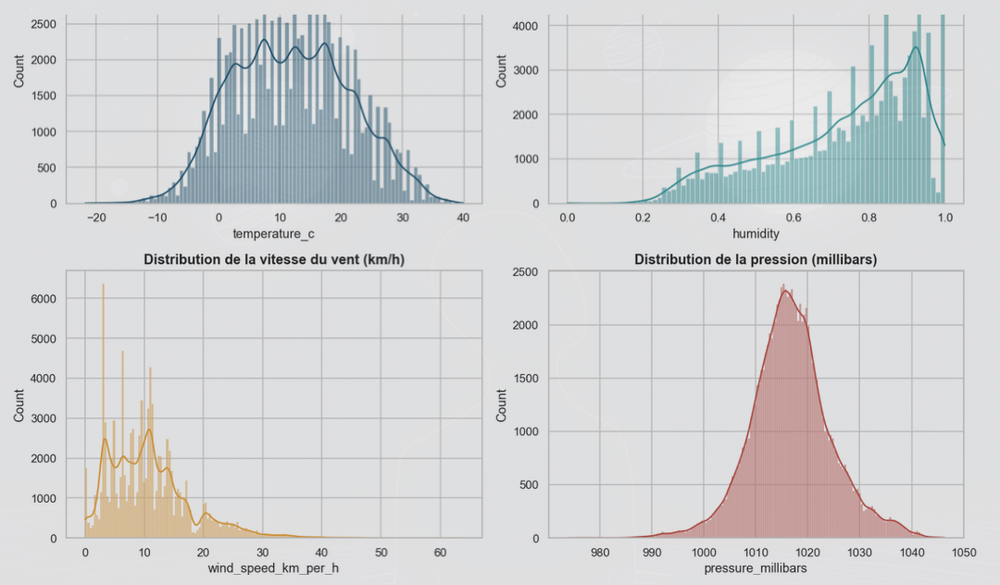
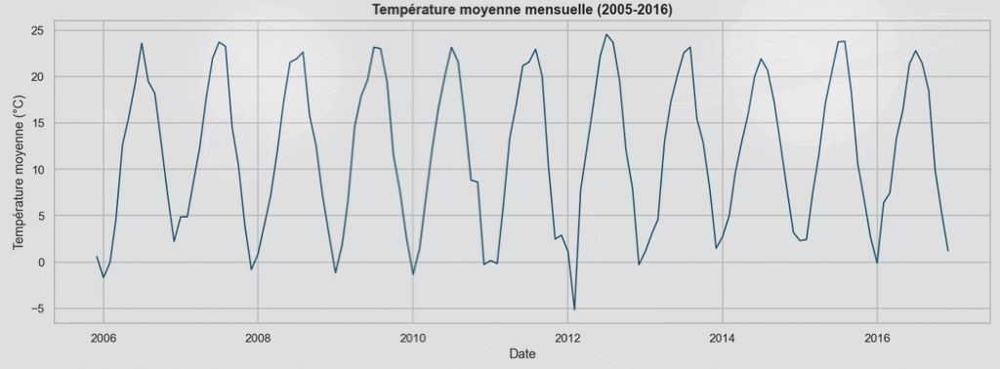
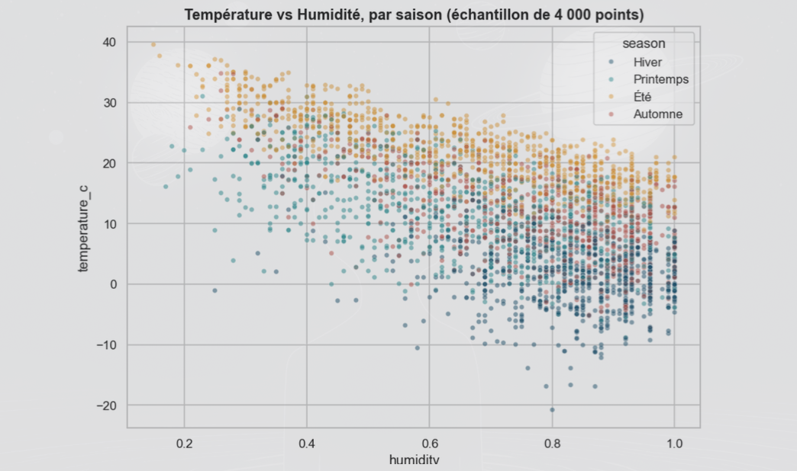
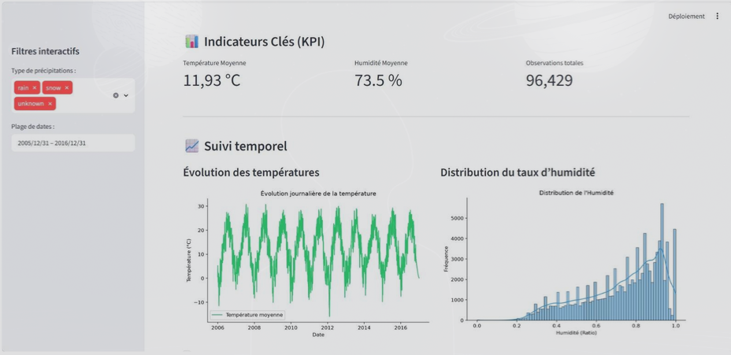

<!-- _class: lead -->

<!-- _paginate: false -->

# Weather Data Platform

## De l’ingestion des données à l’analyse et à la prédiction

**ForceN — Groupe A**

Juillet 2026

---

## Contexte et objectifs

Le projet vise à exploiter un dataset météo Kaggle portant sur la ville de Szeged, en Hongrie, entre 2005 et 2016, afin de produire une chaîne complète de traitement, d’analyse et de valorisation des données.

| Contribution du groupe   | Objectif|
|---|---|
| Collecte et ingestion    | Récupérer les données brutes depuis Kaggle |
| Traitement / ETL         | Nettoyer, normaliser et préparer les données |
| Stockage                 | Organiser les données dans MinIO et MongoDB |
| Analyse et visualisation | Explorer les tendances et produire des indicateurs |
| Tableau de bord          | Rendre les résultats interactifs et lisibles |
| Modélisation             | Tester une première approche de prédiction |

> Objectif : livrer une solution **reproductible, documentée et exploitable** par l’ensemble du groupe.

---

## Architecture

  

**Extract** → **Ingestion MinIO** → **Transform** → **Load MongoDB** → **Analyse / Visualisation / Modélisation**

---

## Stack technique - ETL

Trois services principaux sont orchestrés avec `docker-compose.yml` :

| Service     | Image          | Port(s)     | Rôle                    |
| ----------- | -------------- | ----------- | ----------------------- |
| **MongoDB** | `mongo:latest` | 27017       | Data Warehouse          |
| **MinIO**   | `minio/minio`  | 9000 / 9001 | Data Lake (S3)          |
| **NiFi**    | `apache/nifi`  | 8443        | Orchestration ingestion |

Démarrage en une commande : `python scripts/setup.py`

---

## Extract — récupération du dataset

**Script** : `etl/extract.py` (via `kagglehub`)

```python
src = kagglehub.dataset_download("muthuj7/weather-dataset")
shutil.copytree(src, Path("./data/raw"), dirs_exist_ok=True)
```

| Métrique | Valeur |
|---|---|
| Source | Kaggle — `muthuj7/weather-dataset` |
| Fichier | `weatherHistory.csv` |
| Lignes brutes | <span class="metric">96 453</span> · 12 colonnes |

---

## Ingestion vers MinIO

Deux mécanismes permettent d’écrire les données brutes dans le bucket `weather-lake` :

| Mécanisme                          | Usage                | Destination         |
| ---------------------------------- | -------------------- | ------------------- |
| **NiFi** `GetFile` → `PutS3Object` | Ingestion visualisée | `weather-lake/raw/` |
| **Python** (`upload_raw_to_minio`) | Pipeline automatisé  | idem                |

Flux d’ingestion NiFi vers MinIO :

---

## NiFi — Processors

Le flux NiFi récupère les fichiers bruts puis les dépose automatiquement dans MinIO via une connexion compatible S3.

| Processeur      | Configuration clé                                                                                 |
| --------------- | ------------------------------------------------------------------------------------------------- |
| **GetFile**     | `Input Directory` : `/opt/nifi/input`                                                             |
| **PutS3Object** | `Bucket` : `weather-lake`<br>`Object Key` : `raw/${filename}`<br>`Endpoint` : `http://minio:9000` |

Le Controller Service `AWSCredentialsProviderControllerService` est configuré avec les identifiants MinIO.

---

## NiFi — Vue du process group

  

Guide complet : `rapport/docs/nifi-ingestion.md`

---

## Transform — nettoyage et normalisation

**Script** : `etl/transform.py` (pandas)
> Lit `raw/weatherHistory.csv` depuis MinIO (`weather-lake`), applique le nettoyage, écrit localement et dans MinIO (`weather-processed`).
- Normalisation des colonnes en `snake_case`
- Parsing des dates en UTC (`date_time`)
- Suppression des doublons et lignes sans mesures essentielles
- Nettoyage texte (`summary`, `precip_type`, `daily_summary`)
- Traitement des manquants : interpolation temporelle + médiane
- Correction des valeurs numériques incohérentes
- Suppression de `loud_cover` (colonne constante)
- Enrichissement (version ENRICHED) : colonnes temporelles dérivées

---

## Transform — impact global

| Indicateur | Avant | Après |
|---|---:|---:|
| Lignes | 96 453 | <span class="metric">96 429</span> |
| Colonnes | 12 | 11 |
| Doublons | Présents | Supprimés |
| Valeurs manquantes | Nombreuses | Réduites / imputées |
| Valeurs numériques incohérentes | Présentes | Corrigées |
| Colonne constante | Présente | Retirée |

### Résultat

Le dataset devient plus propre, plus stable et plus exploitable pour l’analyse et la prédiction.

---

## Fichiers produits

| Fichier                              | Emplacement MinIO    | Utilisation                    |
| ------------------------------------ | -------------------- | ------------------------------ |
| `weather_processed.csv`              | `weather-processed/` | Base nettoyée                  |
| `weather_processed.parquet`          | `weather-processed/` | Format columnar                |
| `weather_processed_enriched.csv`     | `weather-processed/` | Variables temporelles ajoutées |
| `weather_processed_enriched.parquet` | `weather-processed/` | Version enrichie               |
| `weatherHistory_clean_metadata.json` | `weather-processed/` | Métadonnées du run             |

**Copie locale :** `data/processed/weather_processed.csv`

---

## MinIO — Stockage

Deux buckets séparent zone raw et zone curated :

 

`weather-lake` (raw) · `weather-processed` (CSV, Parquet, metadata)

---

## Load — Data Warehouse MongoDB

**Script** : `etl/load.py` (`pymongo`)

| Élément           | Valeur                                 |
| ----------------- | -------------------------------------- |
| Base / Collection | `weather_dwh` / `weather_observations` |
| Documents chargés | <span class="metric">96 429</span>     |
| Mode              | Remplacement complet                   |
| Index             | `date_time`, `precip_type`             |
| Batch size        | 5 000                                  |

Restauration fournie via `mongodump` / `mongorestore`.

---

## MongoDB — Schéma d'un document

Les données transformées sont stockées dans MongoDB sous forme de documents JSON.

```json
{
  "date_time": "2006-01-01T00:00:00Z",
  "summary": "Mostly Cloudy",
  "precip_type": "rain",
  "temperature_c": 1.16,
  "apparent_temperature_c": -3.24,
  "humidity": 0.85,
  "wind_speed_km_per_h": 16.62,
  "wind_bearing_degrees": 139.0,
  "visibility_km": 9.90,
  "pressure_millibars": 1016.15,
  "daily_summary": "Mostly cloudy throughout the day."
}
```

### **Restauration de la base** : `rapport/exports/database/README.md`

---

## Livrables — ETL

| Livrable | Emplacement | Format |
|---|---|---|
| Dataset nettoyé | `rapport/exports/data/processed/weather_processed.csv` | CSV (~11 colonnes) |
| Dataset brut | `rapport/exports/data/raw/weatherHistory.csv` | CSV |
| Dump MongoDB | `rapport/exports/database/dump/` | BSON (`mongodump`) |
| Code + infra | [weather-data-platform](https://github.com/Mourtalla-8/weather-data-platform) | Git + Docker |

---

## Analyse — EDA (Analyse exploratoire des données)

L’exploration du dataset a permis d’étudier :

- la température;
- l’humidité;
- la vitesse du vent;
- la pression atmosphérique.

Les analyses réalisées comprennent :

- statistiques descriptives;
- distributions des variables;
- évolution temporelle;
- étude des relations entre variables.

---

## Saisonnalité des températures

L’évolution de la température moyenne mensuelle sur la période 2005–2016 montre :

- une forte saisonnalité;
- une cohérence avec un climat continental typique.

Les températures moyennes observées varient notamment entre :

| Saison | Température moyenne |
|---|---:|
| Hiver | ≈ 1,5 °C |
| Été | ≈ 22 °C |

---

## Analyse — Résultats statistiques

Des tests statistiques ont été réalisés afin de vérifier les relations observées.

| Analyse | Résultat |
|---|---|
| Corrélation température / humidité | r = -0,63 |
| Significativité | p < 0,001 |
| Différences entre saisons | Significatives |
| Vent selon type de précipitation | Différence significative |

La relation entre température et humidité montre donc un lien négatif fort.

---

## Détection des valeurs aberrantes

Une détection des valeurs extrêmes a été réalisée avec la méthode de l’écart interquartile (IQR).

Variables étudiées :

- vitesse du vent;
- pression atmosphérique.

Résultat :

- certaines valeurs extrêmes ont été détectées;
- elles restent physiquement plausibles;
- elles n’ont donc pas été supprimées.

---

## Visualisation des données

_Représentation graphique des distributions, tendances temporelles et relations entre variables météorologiques._

Des graphiques ont été produits afin de représenter:

- les distributions des variables météorologiques;
- les tendances temporelles;
- les relations entre variables.

---

## Distribution des variables météorologiques


---

## Évolution de la température moyenne mensuelle (2005–2016)


---

## Relation entre température et humidité selon la saison


---

## Visualisation et tableau de bord

_Transformation des résultats analytiques en indicateurs accessibles grâce à une interface interactive._

---

## Tableau de bord interactif Streamlit

Un tableau de bord interactif a été développé avec Streamlit.

Il permet de suivre :

- la température moyenne;
- le taux d’humidité;
- le nombre total d’observations.

Il propose également :

- un filtrage par type de précipitations;
- un filtrage par période.

---

## Représentation dans le tableau de bord

Le tableau de bord présente :

- l’évolution journalière de la température;
- la distribution du taux d’humidité;
- les indicateurs sélectionnés selon les filtres appliqués.


---

## Tableau de bord Streamlit



---

## Apprentissage automatique

_Construction d’un modèle permettant d’estimer la température à partir des variables météorologiques disponibles._

---

## Construction d'un modèle

Un modèle de prédiction de la température a été développé.

Variables utilisées :

- humidité;
- vitesse du vent;
- pression atmosphérique;
- variables temporelles;
- variables retardées correspondant aux températures précédentes.

---

## Préparation des données pour le modèle

Les données ont été séparées chronologiquement en trois ensembles :

| Ensemble | Proportion |
|---|---:|
| Entraînement | 70 % |
| Validation | 15 % |
| Test | 15 % |

Cette séparation permet d’évaluer le modèle sur une période non utilisée pendant l’apprentissage.


---

## Résultats du modèle

Un modèle de forêt aléatoire (Random Forest) a été entraîné pour estimer la température à partir des variables explicatives.

Résultats obtenus :

| Indicateur | Valeur |
|---|---:|
| Erreur moyenne absolue (MAE) | <span class="metric">0,56 °C</span> |
| Coefficient de détermination (R²) | <span class="metric">0,993</span> |

La comparaison entre températures réelles et prédites montre une bonne adéquation avec les variations saisonnières et journalières.

---

## Conclusion

Le groupe a livré une chaîne complète de traitement et d’exploitation des données météorologiques.

| Étape         | Technologie                     | Résultat                           |
| ------------- | ------------------------------- | ---------------------------------- |
| Extract       | Python + Kaggle                 | Données brutes récupérées          |
| Ingestion     | NiFi + MinIO                    | Stockage raw                       |
| Transform     | Python + pandas                 | Données nettoyées et enrichies     |
| Load          | pymongo                         | Base MongoDB exploitable           |
| Analyse / Viz | pandas + matplotlib + Streamlit | Indicateurs et dashboard           |
| Modélisation  | scikit-learn                    | Première prédiction de température |

> Le projet fournit une base solide pour la rédaction finale, l’analyse métier et les évolutions futures.

---

<!-- _class: lead -->

<!-- _paginate: false -->

# Merci

## Questions

**ForceN — Groupe A**
