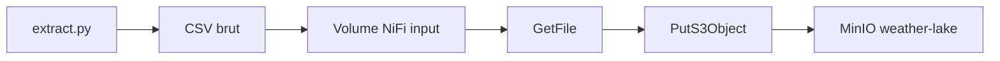
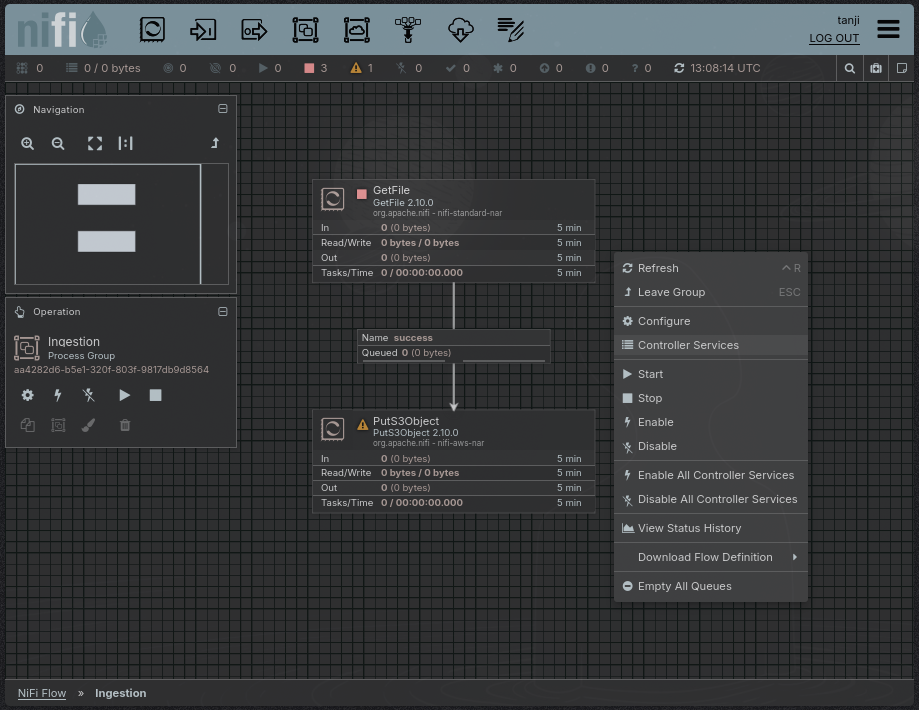
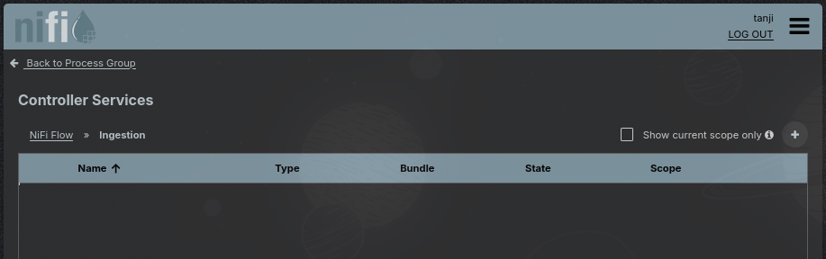
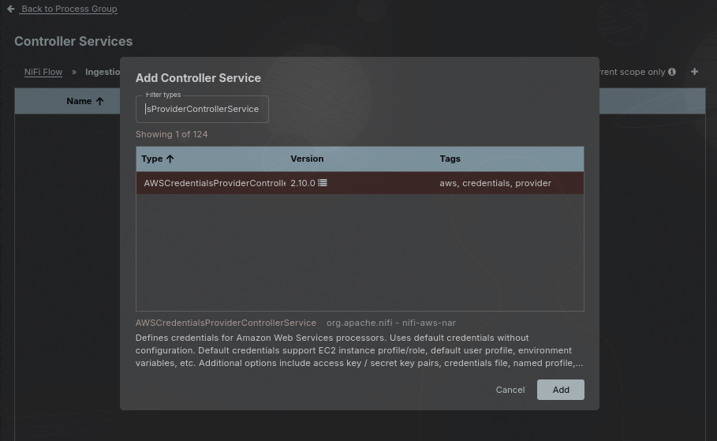
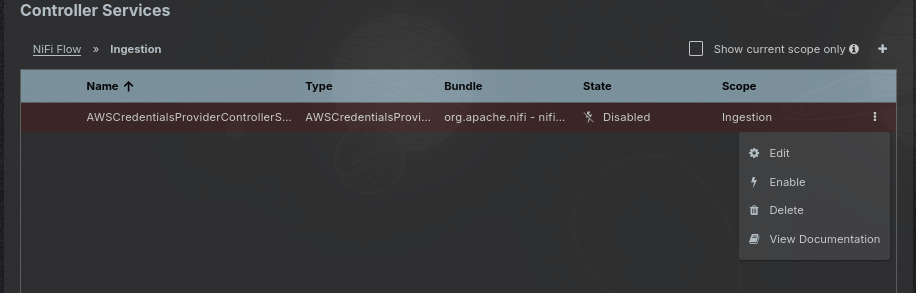
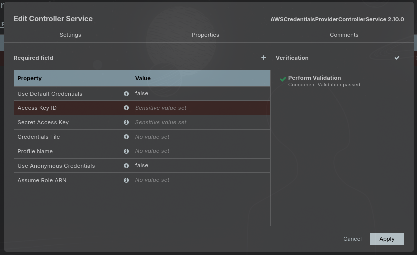
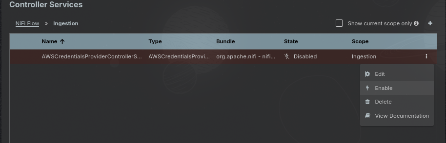
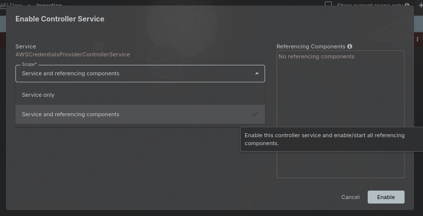
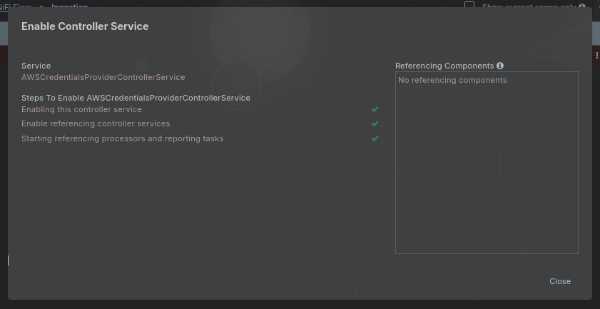
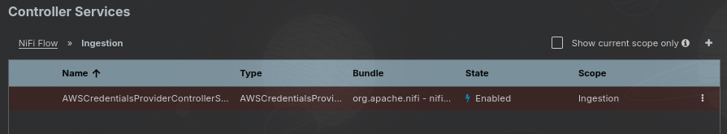

# Guide d'ingestion NiFi - Weather ETL

**Projet** : Data Engineering - ForceN, Groupe A  
**Composant** : Apache NiFi 2.x - Process Group `Ingestion`  
**Objectif** : déposer le CSV brut dans MinIO (`weather-lake/raw/`)

---

## Sommaire

1. [Contexte et rôle de NiFi](#1-contexte-et-rôle-de-nifi)
2. [Prérequis](#2-prérequis)
3. [Vue d'ensemble du flux](#3-vue-densemble-du-flux)
4. [Configuration du Process Group](#4-configuration-du-process-group)
5. [Controller Service MinIO (AWS Credentials)](#5-controller-service-minio-aws-credentials)
6. [Mise en service et vérification](#6-mise-en-service-et-vérification)
7. [Import rapide du Process Group (JSON)](#7-import-rapide-du-process-group-json)
8. [Dépannage](#8-dépannage)

---

## 1. Contexte et rôle de NiFi

Dans notre architecture, NiFi assure la **couche d'ingestion** : il surveille le répertoire local des fichiers bruts et les envoie vers le data lake MinIO.

| Élément | Valeur |
|---|---|
| Interface NiFi | [https://localhost:8443/nifi](https://localhost:8443/nifi) |
| Répertoire surveillé (conteneur) | `/opt/nifi/input` |
| Répertoire hôte (monté par Docker) | `./data/raw/` |
| Bucket MinIO cible | `weather-lake` |
| Clé objet | `raw/${filename}` |

> **Note - pipeline automatisé**  
> Le script [`scripts/run_pipeline.py`](../scripts/run_pipeline.py) peut aussi envoyer le CSV brut vers MinIO via Python (`upload_raw_to_minio`). NiFi reste la voie d'ingestion **documentée et reproductible** pour l'orchestration ; les deux approches écrivent au même emplacement MinIO.

---

## 2. Prérequis

- Stack Docker démarrée : `python scripts/setup.py`
- Fichier `.env` configuré (credentials MinIO / NiFi)
- Dataset brut présent : `./data/raw/weatherHistory.csv` (via `python etl/extract.py` ou `run_pipeline.py`)
- Accès à l'interface NiFi avec les identifiants `NIFI_USER` / `NIFI_PASSWORD` du `.env`

Credentials MinIO utilisés par le Controller Service (identiques à `.env`) :

| Variable | Rôle |
|---|---|
| `MINIO_ACCESS_KEY` | Access Key ID |
| `MINIO_SECRET_KEY` | Secret Access Key |

---

## 3. Vue d'ensemble du flux



<!-- Fallback si Mermaid non supporté par le viewer -->


**Chaîne de processeurs** (Process Group `Ingestion`) :

```
GetFile  ──success──▶  PutS3Object
```

---

## 4. Configuration du Process Group

Créer un Process Group nommé **`Ingestion`**, puis ajouter et connecter les deux processeurs suivants.

### 4.1 Processeur `GetFile`

| Propriété | Valeur |
|---|---|
| **Input Directory** | `/opt/nifi/input` |
| **Keep Source File** | `false` |
| **Polling Interval** | `30 sec` |
| **File Filter** | `[^\.].*` |
| **Recurse Subdirectories** | `true` |

Le processeur lit les fichiers déposés dans `./data/raw/` (monté dans le conteneur NiFi).

### 4.2 Processeur `PutS3Object`

| Propriété | Valeur |
|---|---|
| **Bucket** | `weather-lake` |
| **Object Key** | `raw/${filename}` |
| **Endpoint Override URL** | `http://minio:9000` |
| **Use Path Style Access** | `true` |
| **Region** | `us-west-2` (valeur par défaut, sans impact sur MinIO) |
| **AWS Credentials Provider Service** | `AWSCredentialsProviderControllerService` |

> MinIO est compatible S3 : le processeur AWS `PutS3Object` pointe vers MinIO via **Endpoint Override URL** et le mode path-style.

---

## 5. Controller Service MinIO (AWS Credentials)

Le processeur `PutS3Object` exige un **Controller Service** de type `AWSCredentialsProviderControllerService`.  
Ce service n'est **pas inclus** dans l'export JSON du Process Group : il doit être créé et activé manuellement.

### Étape 1 - Ouvrir la fenêtre Controller Services

Clic droit sur le canevas NiFi -> **Configure Controller Services**.



### Étape 2 - Ajouter le service

Cliquer sur **+** (Add Controller Service), rechercher `AWSCredentialsProviderControllerService`, puis l'ajouter.





### Étape 3 - Configurer les identifiants MinIO

Ouvrir la configuration du service nouvellement créé.



Renseigner :

| Champ NiFi | Valeur (.env) |
|---|---|
| **Access Key ID** | `MINIO_ACCESS_KEY` |
| **Secret Access Key** | `MINIO_SECRET_KEY` |


Cliquer sur l'icône **Verification** (à droite). Le message attendu est :

> **Component Validation passed**



Puis **Apply** pour enregistrer.

### Étape 4 - Activer le service

Activer `AWSCredentialsProviderControllerService` avec le scope **Service and referencing components**.





État attendu après activation :





### Étape 5 - Lier le service au processeur PutS3Object

Dans les propriétés de `PutS3Object`, sélectionner le Controller Service activé pour **AWS Credentials Provider Service**.


---

## 6. Mise en service et vérification

1. Démarrer le Process Group `Ingestion` (clic droit -> **Start**).
2. Vérifier que `GetFile` et `PutS3Object` sont en état **Running**.
3. Contrôler MinIO :
   - Console : [http://localhost:9001](http://localhost:9001)
   - Bucket `weather-lake` -> objet `raw/weatherHistory.csv`
4. Lancer la suite du pipeline :
   ```bash
   python etl/transform.py
   python etl/load.py
   ```
   Ou en une commande : `python scripts/run_pipeline.py`

---

## 7. Import rapide du Process Group (JSON)

Pour gagner du temps, vous pouvez importer le Process Group préconfiguré (processeurs + connexion) via **copier-coller** du JSON ci-dessous dans le canevas NiFi.

> **Limites de l'import JSON**
> - Le Controller Service **n'est pas exporté** : suivre la [section 5](#5-controller-service-minio-aws-credentials).
> - L'UUID du Controller Service référencé dans `PutS3Object` ne correspondra pas à votre instance : re-sélectionner le service après import.

<details>
<summary>JSON du Process Group <code>Ingestion</code> (cliquer pour afficher)</summary>

```json
{
  "id": "ea38599a-1cde-435a-875b-4942ca0f39da",
  "externalControllerServiceReferences": {},
  "parameterContexts": {},
  "parameterProviders": {},
  "processGroups": [
    {
      "identifier": "6afc24a0-019f-1000-f820-2912dfe08909",
      "instanceIdentifier": "aa4282d6-b5e1-320f-803f-9817db9d8564",
      "name": "Ingestion",
      "comments": "",
      "position": { "x": 97, "y": -160 },
      "processGroups": [],
      "remoteProcessGroups": [],
      "processors": [
        {
          "identifier": "6afc24a2-019f-1000-7ff7-94873beef080",
          "instanceIdentifier": "bf5199ca-4161-3513-ecdb-f00f49c89121",
          "name": "PutS3Object",
          "comments": "",
          "position": { "x": -1392, "y": -976 },
          "type": "org.apache.nifi.processors.aws.s3.PutS3Object",
          "bundle": {
            "group": "org.apache.nifi",
            "artifact": "nifi-aws-nar",
            "version": "2.10.0"
          },
          "properties": {
            "Endpoint Override URL": "http://minio:9000",
            "Use Path Style Access": "true",
            "Object Key": "raw/${filename}",
            "Bucket": "weather-lake",
            "AWS Credentials Provider Service": "50960090-f62d-348b-b6b0-3d13edd8ba61",
            "Region": "us-west-2",
            "Communications Timeout": "30 secs"
          },
          "scheduledState": "ENABLED",
          "componentType": "PROCESSOR",
          "groupIdentifier": "6afc24a0-019f-1000-f820-2912dfe08909"
        },
        {
          "identifier": "6afc24a1-019f-1000-a6ad-772a5d5dc0c8",
          "instanceIdentifier": "0754cd5d-f8e1-3043-5de8-10155e9ddade",
          "name": "GetFile",
          "comments": "",
          "position": { "x": -1392, "y": -1264 },
          "type": "org.apache.nifi.processors.standard.GetFile",
          "bundle": {
            "group": "org.apache.nifi",
            "artifact": "nifi-standard-nar",
            "version": "2.10.0"
          },
          "properties": {
            "Input Directory": "/opt/nifi/input",
            "Keep Source File": "false",
            "Polling Interval": "30 sec",
            "Batch Size": "10",
            "Ignore Hidden Files": "true",
            "Recurse Subdirectories": "true",
            "File Filter": "[^\\.].*"
          },
          "scheduledState": "ENABLED",
          "componentType": "PROCESSOR",
          "groupIdentifier": "6afc24a0-019f-1000-f820-2912dfe08909"
        }
      ],
      "connections": [
        {
          "identifier": "6afc24a3-019f-1000-ec44-599ad9dbde0e",
          "source": {
            "id": "6afc24a1-019f-1000-a6ad-772a5d5dc0c8",
            "type": "PROCESSOR",
            "name": "GetFile"
          },
          "destination": {
            "id": "6afc24a2-019f-1000-7ff7-94873beef080",
            "type": "PROCESSOR",
            "name": "PutS3Object"
          },
          "selectedRelationships": ["success"],
          "componentType": "CONNECTION",
          "groupIdentifier": "6afc24a0-019f-1000-f820-2912dfe08909"
        }
      ],
      "controllerServices": [],
      "componentType": "PROCESS_GROUP"
    }
  ],
  "remoteProcessGroups": [],
  "processors": [],
  "connections": []
}
```

</details>

Le JSON complet (avec tous les descripteurs de propriétés) est disponible dans l'historique Git du dépôt ; la version ci-dessus contient uniquement les champs utiles à la reconfiguration.

---

## 8. Dépannage

| Symptôme | Cause probable | Action |
|---|---|---|
| `PutS3Object` en erreur « credentials » | Controller Service absent ou inactif | Refaire la [section 5](#5-controller-service-minio-aws-credentials) |
| Aucun fichier ingéré | Process Group arrêté ou répertoire vide | Démarrer le flux ; vérifier `./data/raw/weatherHistory.csv` |
| Connexion refusée vers MinIO | MinIO non prêt | `docker compose ps` ; attendre le healthcheck port 9000 |
| Objet absent dans le bucket | Mauvais bucket ou clé | Vérifier `weather-lake` et `raw/${filename}` |
| Validation échouée | Clés MinIO incorrectes | Aligner `MINIO_ACCESS_KEY` / `MINIO_SECRET_KEY` avec `.env` |

---

*Guide rédigé par l'équipe Data Engineering - ForceN, Groupe A.*
