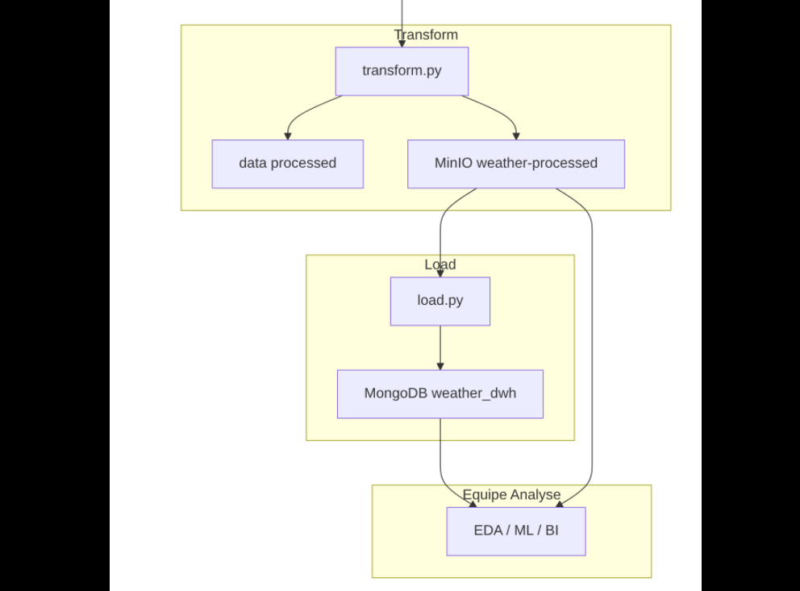

<!-- _class: lead -->
<!-- _paginate: false -->

# Weather ETL Platform

## Pipeline Extract · Transform · Load

**Data Engineering — ForceN**
Groupe A - Équipe ETL

Juillet 2026

---

## Contexte et objectifs

Transformer un dataset météo brut (Kaggle) en données exploitables pour l'équipe **Analyse / EDA / ML / BI**.

| Notre contribution ETL | Objectif |
|---|---|
| Extraction du dataset météo depuis Kaggle | Récupérer les données sources brutes |
| Stockage raw dans MinIO (`weather-lake`) | Conserver une zone de données originales |
| Transformation avec Python / pandas | Nettoyer, normaliser et préparer les données |
| Stockage des données transformées dans MinIO (`weather-processed`) | Conserver une zone de données nettoyées et prêtes à l'exploitation |
| Chargement dans MongoDB (`weather_dwh`) | Mettre à disposition un Data Warehouse exploitable |
| Automatisation et documentation | Rendre le pipeline reproductible et faciliter sa réutilisation |

> Objectif : un pipeline **reproductible, documenté et prêt à la passation**.

---

## Architecture globale

 

**Extract** → **Ingestion MinIO** → **Transform** → **Load MongoDB** → Équipe Analyse

---

## Stack Docker

Trois services orchestrés par `docker-compose.yml` :

| Service | Image | Port(s) | Rôle |
|---|---|---|---|
| **MongoDB** | `mongo:latest` | 27017 | Data Warehouse |
| **MinIO** | `minio/minio` | 9000 / 9001 | Data Lake (S3) |
| **NiFi** | `apache/nifi` | 8443 | Orchestration ingestion |

Démarrage en une commande : `python scripts/setup.py`

---

## Extract — récupération du dataset

**Script** : `etl/extract.py` (via `kagglehub`)

```python
src = kagglehub.dataset_download("muthuj7/weather-dataset")
shutil.copytree(src, Path("./data/raw"), dirs_exist_ok=True)
```

| Métrique | Valeur |
|---|---|
| Source | Kaggle — `muthuj7/weather-dataset` |
| Fichier | `weatherHistory.csv` |
| Lignes brutes | <span class="metric">96 453</span> · 12 colonnes |

---

## Ingestion vers MinIO

Deux mécanismes écrivent le CSV brut dans le bucket `weather-lake` : :

| Mécanisme | Usage | Destination |
|---|---|---|
| **NiFi** `GetFile` → `PutS3Object` | Démonstration orchestration | `weather-lake/raw/` |
| **Python** (`upload_raw_to_minio`) | Pipeline automatisé `scripts/run_pipeline.py` | idem |

Flux d'ingestion NiFi vers MinIO :


---

## NiFi — Processors

Le flux NiFi permet de récupérer les fichiers bruts depuis `data/raw` et de les déposer automatiquement dans MinIO via une connexion compatible S3.

| Processeur | Configuration clé |
|---|---|
| **GetFile** | **Input Directory** : `/opt/nifi/input` |
| **PutS3Object** | **Bucket** : `weather-lake`<br>**Object Key** : `raw/${filename}`<br>**Endpoint** : `http://minio:9000` |

Le Controller Service `AWSCredentialsProviderControllerService` doit être configuré avec `MINIO_ACCESS_KEY` et `MINIO_SECRET_KEY`.

---

## NiFi — Process Group

 

Guide pas à pas complet : `rapport/nifi-ingestion.md`

---

## Transform — nettoyage et normalisation

**Script** : `etl/transform.py` (pandas)
> Lit `raw/weatherHistory.csv` depuis MinIO (`weather-lake`), applique le nettoyage, écrit localement et dans MinIO (`weather-processed`).
- Normalisation des colonnes en `snake_case`
- Parsing des dates en UTC (`date_time`)
- Suppression des doublons et lignes sans mesures essentielles
- Nettoyage texte (`summary`, `precip_type`, `daily_summary`)
- Traitement des manquants : interpolation temporelle + médiane
- Correction des valeurs numériques incohérentes
- Suppression de `loud_cover` (colonne constante)
- Enrichissement (version ENRICHED) : colonnes temporelles dérivées

---

## Transform — impact global

| Indicateur | Avant | Après |
|---|---:|---:|
| Lignes | 96 453 | <span class="metric">96 429</span> |
| Colonnes | 12 | 11 |
| Doublons | Présents | Supprimés |
| Valeurs manquantes | Nombreuses | Réduites / imputées |
| Valeurs numériques incohérentes | Présentes | Corrigées |
| Colonne constante | Présente | Retirée |

### Résultat

Le dataset devient plus propre, plus stable et plus simple à charger dans MongoDB.

---

## Fichiers produits

| Fichier | Emplacement MinIO | Utilisation |
|---|---|---|
| `weather_processed.csv` | `weather-processed/` | Source du load MongoDB |
| `weather_processed.parquet` | `weather-processed/` | Format columnar |
| `weather_processed_enriched.csv` | `weather-processed/` | + features temporelles |
| `weather_processed_enriched.parquet` | `weather-processed/` | Version Parquet enrichie |
| `weatherHistory_clean_metadata.json` | `weather-processed/` | Métadonnées du run |

**Copie locale :** `data/processed/weather_processed.csv`

---

## MinIO — Stockage

Deux buckets séparent zone raw et zone curated :

 

`weather-lake` (raw) · `weather-processed` (CSV, Parquet, metadata)

---

## Load — Data Warehouse MongoDB

**Script** : `etl/load.py` (pymongo)

| Élément | Valeur |
|---|---|
| Base / Collection | `weather_dwh` / `weather_observations` |
| Documents chargés | <span class="metric">96 429</span> |
| Mode | Remplacement complet (pas de doublons) |
| Index | `date_time` (unique), `precip_type` |
| Batch size | 5 000 (configurable via `MONGO_BATCH_SIZE`) |

Restauration fournie via `mongodump` / `mongorestore`.

---

## MongoDB — Schéma d'un document

Les données transformées sont stockées dans MongoDB sous forme de documents JSON.

```json
{
  "date_time": "2006-01-01T00:00:00Z",
  "summary": "Mostly Cloudy",
  "precip_type": "rain",
  "temperature_c": 1.16,
  "apparent_temperature_c": -3.24,
  "humidity": 0.85,
  "wind_speed_km_per_h": 16.62,
  "wind_bearing_degrees": 139.0,
  "visibility_km": 9.90,
  "pressure_millibars": 1016.15,
  "daily_summary": "Mostly cloudy throughout the day."
}
```

### Index créés

| Index | Champ ciblé | Type |
|---|---|---|
| `idx_date_time_unique` | `date_time` | Unique |
| `idx_precip_type` | `precip_type` | Standard |

**Restauration de la base** : `rapport/database/README.md`

---

## Automatisation — Scripts

| Script | Rôle |
|---|---|
| `scripts/setup.py` | `.env`, venv, Docker, attente services |
| `scripts/run_pipeline.py` | Pipeline 4 étapes (extract → upload → transform → load) |
| `scripts/reset.py` | Remise à zéro (`data/`, conteneurs ; option `--full` pour `.venv`) |
| `rapport/scripts/export_assets.sh` | Export CSV + `mongodump` vers `rapport/` |

Protection par **fichier lock** et **vérification TCP** des ports avant exécution.

---

## Livrables

| Livrable | Emplacement | Format |
|---|---|---|
| Dataset nettoyé | `rapport/data/processed/weather_processed.csv` | CSV (~11 colonnes) |
| Dataset brut | `rapport/data/raw/weatherHistory.csv` | CSV |
| Dump MongoDB | `rapport/database/dump/` | BSON (`mongodump`) |
| Code + infra | [weather-DE-Project](https://github.com/Mourtalla-8/weather-DE-Project) | Git + Docker |

---

## Exploitation des résultats

Deux options permettent d'utiliser les résultats du projet :

| Option | Description |
|---|---|
| **Clone GitHub** | Environnement complet et reproductible avec `setup.py` puis `run_pipeline.py` |
| **Archive `rapport/`** | Datasets générés, dump MongoDB, documentation et instructions d'utilisation |

Les fichiers volumineux (datasets CSV et dump MongoDB) ne sont pas versionnés dans Git.  
Ils sont générés après l'exécution complète du pipeline puis exportés dans le dossier `rapport/`.

Après l'exécution du pipeline :
```bash
python scripts/setup.py
python scripts/run_pipeline.py
bash rapport/scripts/export_assets.sh
```

---

## Difficultés rencontrées

| Problème | Impact | Solution retenue |
|---|---|---|
| Configuration du processor **PutS3Object** | Nécessité d'un **AWSCredentialsProviderControllerService** correctement configuré pour accéder à MinIO | Création et configuration du Controller Service avant l'exécution du flux |
| Réalisation des transformations dans NiFi | Difficultés d'environnement et de dépendances pour exécuter directement le nettoyage et la normalisation dans NiFi | Regroupement des traitements dans `etl/transform.py` ; NiFi conservé principalement pour l'ingestion vers MinIO |
| Définition des règles de transformation | Besoin d'analyser le dataset et de comprendre les colonnes avant d'appliquer les traitements | Analyse exploratoire (EDA), recherche documentaire et validation des règles de nettoyage |

---

## Conclusion

Nous avons livré un pipeline ETL **complet, documenté et reproductible** :

| Étape | Technologie | Résultat |
|---|---|---|
| Extract | Python + Kaggle | 96 453 lignes raw |
| Ingestion | NiFi + MinIO (ou upload Python) | `weather-lake/raw/` |
| Transform | Python + pandas | 96 429 lignes clean |
| Load | pymongo | 96 429 documents indexés |

> L'infrastructure Docker permet à toute l'équipe de reproduire l'environnement en local. Les livrables dans `rapport/` sont prêts pour la passation vers l'équipe Analyse.

---

<!-- _class: lead -->
<!-- _paginate: false -->

# Merci

## Questions & réponses

Dépôt : `github.com/Mourtalla-8/weather-DE-Project`
Rapport complet : `rapport/rapport.md`

**Équipe Data Engineering — ForceN, Groupe A**
