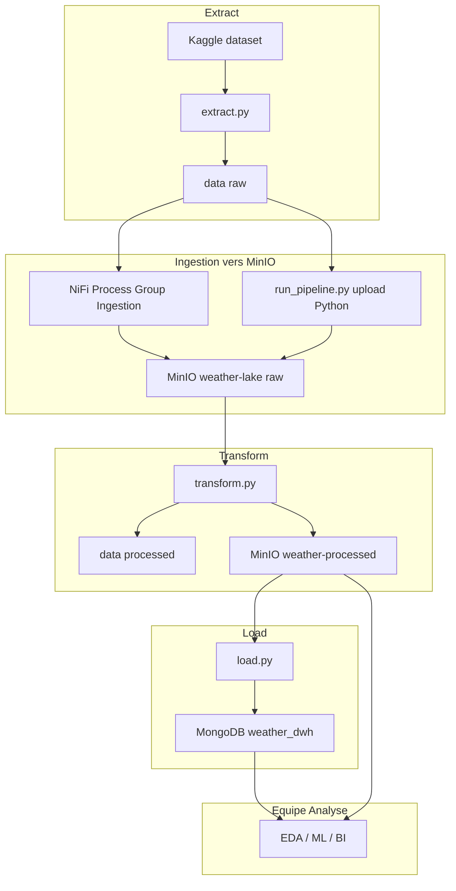
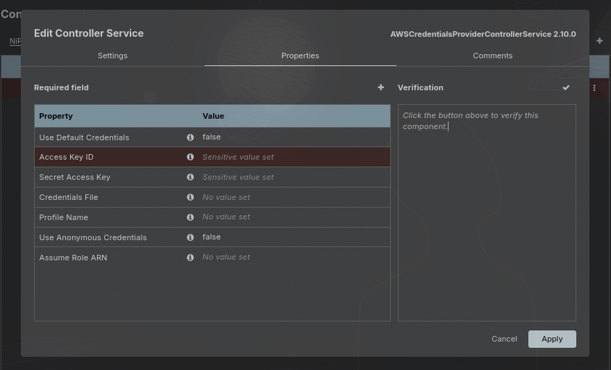
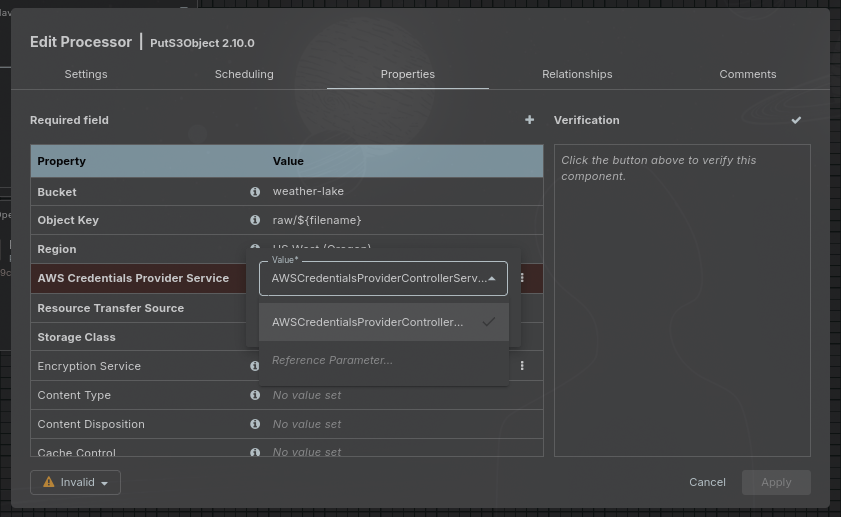
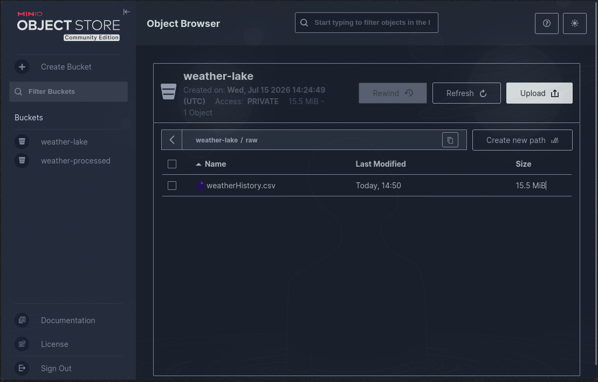

# Rapport ETL - Weather Data Platform

| | |
|---|---|
| **Formation** | Data Engineering - ForceN |
| **Groupe** | Groupe A - Équipe ETL |
| **Projet** | Pipeline météo Extract -> Transform -> Load |
| **Dataset** | [Weather Dataset (Kaggle)](https://www.kaggle.com/datasets/muthuj7/weather-dataset) |
| **Dépôt** | [weather-DE-Project](https://github.com/Mourtalla-8/weather-DE-Project) |
| **Date** | Juillet 2026 |

---

## Sommaire

1. [Introduction et objectifs](#1-introduction-et-objectifs)
2. [Architecture globale](#2-architecture-globale)
3. [Infrastructure Docker](#3-infrastructure-docker)
4. [Extract - téléchargement du dataset](#4-extract--téléchargement-du-dataset)
5. [Ingestion vers MinIO (NiFi et Python)](#5-ingestion-vers-minio-nifi-et-python)
6. [Transform - nettoyage et normalisation](#6-transform--nettoyage-et-normalisation)
7. [Load - Data Warehouse MongoDB](#7-load--data-warehouse-mongodb)
8. [MinIO - Data Lake](#8-minio--data-lake)
9. [Automatisation et scripts](#9-automatisation-et-scripts)
10. [Qualité des données](#10-qualité-des-données)
11. [Livrables](#11-livrables)
12. [Difficultés rencontrées](#12-difficultés-rencontrées)
13. [Conclusion et perspectives](#13-conclusion-et-perspectives)

---

## 1. Introduction et objectifs

Ce rapport documente la conception, la mise en œuvre et les résultats du pipeline ETL développé par notre équipe. L'objectif est de transformer un dataset météo brut (Kaggle) en données exploitables pour l'équipe **Analyse / EDA / ML / BI**.

### Périmètre de l'équipe ETL

| En scope | Hors scope |
|---|---|
| Extraction et stockage raw (MinIO `weather-lake`) | Modèles ML, dashboards BI |
| Nettoyage, normalisation, enrichissement | Déploiement cloud production |
| Chargement MongoDB (`weather_dwh`) | NiFi pour la transformation (Python uniquement) |
| Scripts d'automatisation et documentation | |

### Livrables principaux

- Code source reproductible (Docker + Python)
- Datasets CSV raw et processed dans `rapport/data/`
- Dump MongoDB restaurable dans `rapport/database/dump/`
- Guide NiFi détaillé : [nifi-ingestion.md](nifi-ingestion.md)

---

## 2. Architecture globale



<!-- Fallback si Mermaid non supporté par le viewer -->


**Enchaînement nominal** (via `python scripts/run_pipeline.py`) :

```
Extract -> Upload raw MinIO -> Transform -> Load MongoDB
```

NiFi constitue la **voie d'ingestion orchestrée** documentée ; le script Python assure le même dépôt MinIO lors de l'exécution automatisée du pipeline.

---

## 3. Infrastructure Docker

Stack définie dans [`docker-compose.yml`](../docker-compose.yml) :

| Service | Image | Port(s) | Rôle |
|---|---|---|---|
| **MongoDB** | `mongo:latest` | 27017 | Data Warehouse |
| **MinIO** | `minio/minio` | 9000 (API), 9001 (console) | Data Lake compatible S3 |
| **NiFi** | `apache/nifi` | 8443 (HTTPS) | Orchestration ingestion |

### Volumes et montages

| Conteneur | Chemin hôte -> conteneur | Usage |
|---|---|---|
| NiFi | `./data/raw` -> `/opt/nifi/input` | Fichiers bruts surveillés par GetFile |
| NiFi | `./scripts` -> `/opt/nifi/custom-scripts` | Scripts auxiliaires |
| MinIO | `./data/minio` -> `/data` | Persistance des buckets |
| MongoDB | `./data/mongo` -> `/data/db` | Persistance de la base |

### Démarrage

```bash
python scripts/setup.py    # .env, venv, docker compose up, attente services
python scripts/run_pipeline.py   # pipeline complet
```

Credentials par défaut (`.env.example`) : utilisateur `groupea_de` pour MongoDB, MinIO et NiFi.

---

## 4. Extract - téléchargement du dataset

**Script** : [`etl/extract.py`](../etl/extract.py)

```python
src = kagglehub.dataset_download("muthuj7/weather-dataset")
dst = Path("./data/raw")
shutil.copytree(src, dst, dirs_exist_ok=True)
```

| Métrique | Valeur |
|---|---|
| Source | Kaggle - `muthuj7/weather-dataset` |
| Fichier produit | `./data/raw/weatherHistory.csv` |
| Lignes brutes | **96 453** |
| Colonnes | 12 |

Copie locale dans le dossier rapport : [`data/raw/weatherHistory.csv`](data/raw/weatherHistory.csv) (générée via [`scripts/export_assets.sh`](scripts/export_assets.sh)).

---

## 5. Ingestion vers MinIO (NiFi et Python)

Deux mécanismes écrivent le CSV brut dans le bucket `weather-lake` :

| Mécanisme | Quand l'utiliser | Destination MinIO |
|---|---|---|
| **NiFi** (`GetFile` -> `PutS3Object`) | Démonstration orchestration, flux continu | `weather-lake/raw/weatherHistory.csv` |
| **Python** (`upload_raw_to_minio`) | Pipeline automatisé `run_pipeline.py` | idem |

### Process Group NiFi `Ingestion`

| Processeur | Configuration clé |
|---|---|
| `GetFile` | Input Directory : `/opt/nifi/input` |
| `PutS3Object` | Bucket : `weather-lake`, Object Key : `raw/${filename}`, Endpoint : `http://minio:9000` |

Le Controller Service `AWSCredentialsProviderControllerService` doit être configuré avec `MINIO_ACCESS_KEY` et `MINIO_SECRET_KEY`.





**Guide pas à pas** (11 captures d'écran, JSON d'import, dépannage) : [nifi-ingestion.md](nifi-ingestion.md)

---

## 6. Transform - nettoyage et normalisation

**Script** : [`etl/transform.py`](../etl/transform.py)

Lit `raw/weatherHistory.csv` depuis MinIO (`weather-lake`), applique le nettoyage, écrit localement et dans MinIO (`weather-processed`).

### Opérations réalisées

1. **Normalisation** des noms de colonnes (snake_case)
2. **Parsing** des dates en UTC (`date_time`)
3. **Suppression** des doublons et lignes sans mesures essentielles
4. **Nettoyage texte** (`summary`, `precip_type`, `daily_summary`)
5. **Traitement des manquants** : interpolation temporelle + médiane
6. **Pression invalide** : valeurs ≤ 0 -> NaN puis imputation
7. **Suppression** de `loud_cover` (colonne constante)
8. **Enrichissement** (version ENRICHED) : colonnes temporelles dérivées

### Rapport qualité

| Métrique | Raw | Clean |
|---|---|---|
| Lignes | 96 453 | **96 429** |
| `precip_type` manquant | 517 | 0 |
| Pression invalide (≤ 0) | 1 288 | 0 |
| Colonnes | 12 | 11 |

### Fichiers produits

| Fichier | Emplacement MinIO | Usage |
|---|---|---|
| `weather_processed.csv` | `weather-processed/` | **Source du load MongoDB** |
| `weather_processed.parquet` | `weather-processed/` | Format columnar |
| `weather_processed_enriched.csv` | `weather-processed/` | + features temporelles |
| `weather_processed_enriched.parquet` | `weather-processed/` | Version Parquet enrichie |
| `weatherHistory_clean_metadata.json` | `weather-processed/` | Métadonnées du run |

Copie locale : [`data/processed/weather_processed.csv`](data/processed/weather_processed.csv)

---

## 7. Load - Data Warehouse MongoDB

**Script** : [`etl/load.py`](../etl/load.py)

| Élément | Valeur |
|---|---|
| Base | `weather_dwh` |
| Collection | `weather_observations` |
| Documents chargés | **96 429** |
| Mode | Remplacement complet de la collection (pas de doublons) |
| Batch size | 5 000 (configurable via `MONGO_BATCH_SIZE`) |

### Schéma document

```json
{
  "date_time": "2006-01-01T00:00:00Z",
  "summary": "Mostly Cloudy",
  "precip_type": "rain",
  "temperature_c": 1.16,
  "apparent_temperature_c": -3.24,
  "humidity": 0.85,
  "wind_speed_km_per_h": 16.62,
  "wind_bearing_degrees": 139.0,
  "visibility_km": 9.90,
  "pressure_millibars": 1016.15,
  "daily_summary": "Mostly cloudy throughout the day."
}
```

### Index créés

| Index | Champ | Type |
|---|---|---|
| `idx_date_time_unique` | `date_time` | unique |
| `idx_precip_type` | `precip_type` | standard |

Restauration du dump : [database/README.md](database/README.md)

---

## 8. MinIO - Data Lake

Deux buckets distincts séparent raw et processed :

| Bucket | Rôle | Contenu typique |
|---|---|---|
| `weather-lake` | Zone raw (data lake) | `raw/weatherHistory.csv` |
| `weather-processed` | Zone curated | CSV, Parquet, metadata JSON |

Console web : [http://localhost:9001](http://localhost:9001)

**Bucket raw - `weather-lake`**



**Bucket processed - `weather-processed`**


---

## 9. Automatisation et scripts

| Script | Rôle |
|---|---|
| [`scripts/setup.py`](../scripts/setup.py) | Première installation : `.env`, venv, Docker, attente services |
| [`scripts/run_pipeline.py`](../scripts/run_pipeline.py) | Pipeline ETL en 4 étapes (extract -> upload -> transform -> load) |
| [`scripts/reset.py`](../scripts/reset.py) | Remise à zéro (`data/`, conteneurs ; option `--full` pour `.venv`) |
| [`rapport/scripts/export_assets.sh`](scripts/export_assets.sh) | Export CSV + `mongodump` vers `rapport/` |

### Exécution type

```bash
python scripts/setup.py                        # une fois après clone
python scripts/run_pipeline.py                 # pipeline complet
bash rapport/scripts/export_assets.sh          # assets pour le livrable
```

Le pipeline utilise un **fichier lock** (`.pipeline.lock` à la racine) pour éviter les exécutions concurrentes, et vérifie la **disponibilité TCP** des ports MongoDB (27017) et MinIO (9000) avant de démarrer.

---

## 10. Qualité des données

### Mapping colonnes raw -> processed

| Raw (`weatherHistory.csv`) | Processed (`weather_processed.csv`) |
|---|---|
| `Formatted Date` | `date_time` |
| `Summary` | `summary` |
| `Precip Type` | `precip_type` |
| `Temperature (C)` | `temperature_c` |
| `Apparent Temperature (C)` | `apparent_temperature_c` |
| `Humidity` | `humidity` |
| `Wind Speed (km/h)` | `wind_speed_km_per_h` |
| `Wind Bearing (degrees)` | `wind_bearing_degrees` |
| `Visibility (km)` | `visibility_km` |
| `Pressure (millibars)` | `pressure_millibars` |
| `Daily Summary` | `daily_summary` |
| `Loud Cover` | *(supprimée - valeur constante)* |

### Règles de qualité appliquées

- Lignes sans `temperature_c`, `apparent_temperature_c` ou `humidity` -> **supprimées**
- `precip_type` null -> **`unknown`**, puis normalisation minuscules
- Pression ≤ 0 -> **NaN**, puis interpolation / médiane
- Dates invalides -> **ligne exclue**

---

## 11. Livrables

| Livrable | Emplacement | Format |
|---|---|---|
| Dataset nettoyé | `rapport/data/processed/weather_processed.csv` | CSV (~11 colonnes) |
| Dataset brut | `rapport/data/raw/weatherHistory.csv` | CSV |
| Dump MongoDB | `rapport/database/dump/` | BSON (`mongodump`) |
| Code + infra | [weather-DE-Project](https://github.com/Mourtalla-8/weather-DE-Project) | Git + Docker |

### Options pour l'équipe Analyse

1. **Clone GitHub** - environnement complet reproductible (`setup.py` + `run_pipeline.py`)
2. **Archive du dossier `rapport/`** - résultats finaux + instructions MongoDB, sans relancer tout le pipeline

Les CSV et le dump MongoDB sont **exclus du dépôt Git** (taille) ; ils se régénèrent avec `bash rapport/scripts/export_assets.sh` après exécution du pipeline.

---

## 12. Difficultés rencontrées

| Problème                                   | Impact                                                                                                                                                        | Solution retenue                                                                                                                                                                                               |
| ------------------------------------------ | ------------------------------------------------------------------------------------------------------------------------------------------------------------- | -------------------------------------------------------------------------------------------------------------------------------------------------------------------------------------------------------------- |
| Configuration du processor **PutS3Object** | Le processor nécessitait un **AWSCredentialsProviderControllerService** correctement configuré pour accéder à MinIO                                           | Création et configuration du Controller Service avant l'exécution du flux                                                                                                                                      |
| Réalisation des transformations dans NiFi  | Des problèmes d'environnement et de dépendances ont compliqué l'exécution des traitements (nettoyage, transformation, normalisation) directement dans NiFi    | Les traitements ont finalement été regroupés dans le script `etl/transform.py`, NiFi étant utilisé principalement pour l'ingestion des données de `data/raw` de Kaggle vers le bucket `weather-lake` sur MinIO |
| Définition des règles de transformation    | Il a fallu comprendre le contexte du jeu de données, la signification des colonnes et analyser les données brutes avant de choisir les traitements appropriés | Recherche documentaire, analyse exploratoire (EDA) et validation des choix de nettoyage, transformation et normalisation                                                                                       |


---

## 13. Conclusion

Nous avons livré un pipeline ETL **complet, documenté et reproductible** :

| Étape | Technologie | Résultat |
|---|---|---|
| Extract | Python + Kaggle | 96 453 lignes raw |
| Ingestion | NiFi + MinIO (ou upload Python) | `weather-lake/raw/` |
| Transform | Python + pandas | 96 429 lignes clean |
| Load | pymongo | 96 429 documents indexés |

L'infrastructure Docker permet à toute l'équipe de reproduire l'environnement en local. Les livrables dans `rapport/` sont prêts pour la passation vers l'équipe Analyse.

---

*Rapport rédigé par l'équipe Data Engineering - ForceN, Groupe A.*
